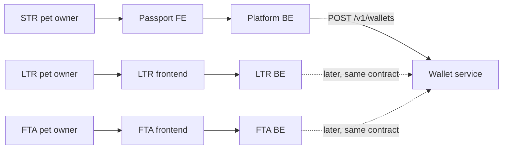
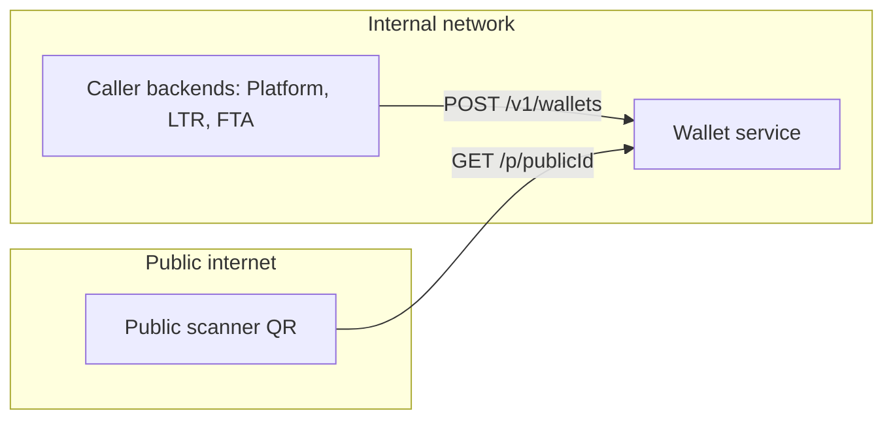
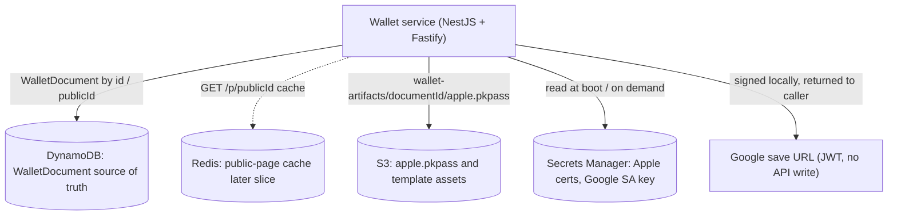
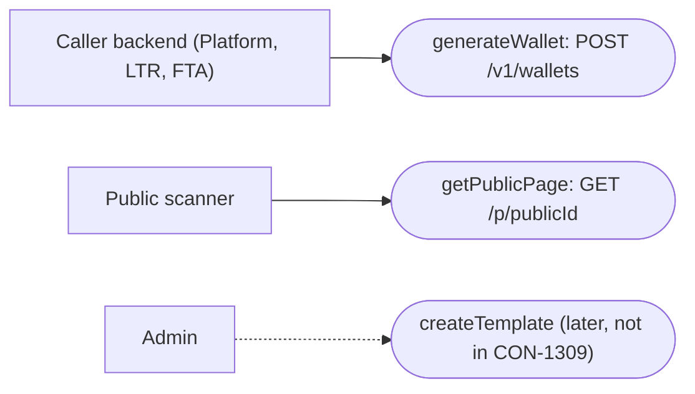
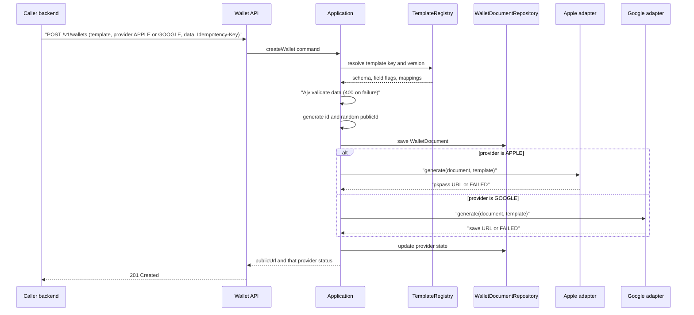
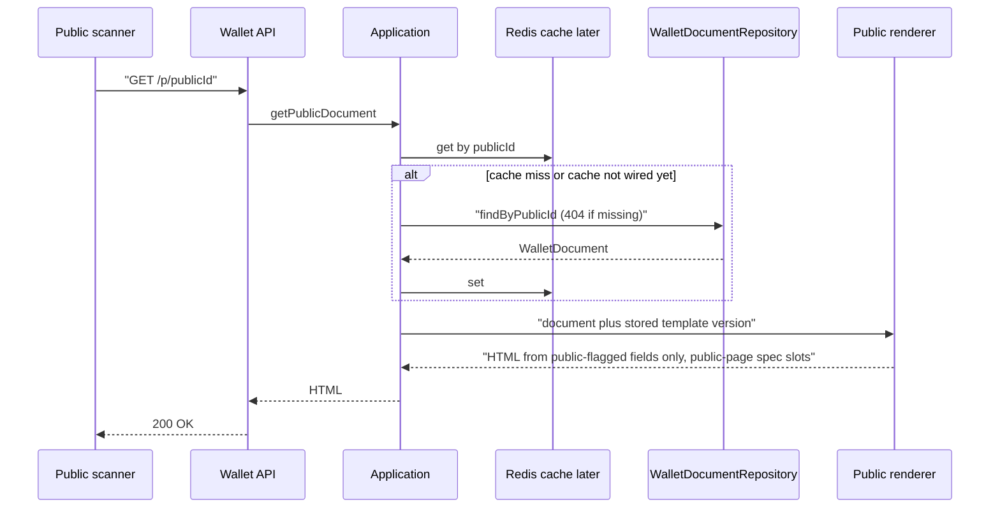

# Diagrams

**Status:** accepted  
**Date:** 2026-08-25  
**Relates-to:** [PDR](PDR.md), [SDD](SDD.md), [ADR-001](ADR-001-wallet-generation-service-architecture.md), [wallet-api](specs/wallet-api.md)

Single source for figures. All diagrams are Mermaid (text, diffable) so they stay alive with the code and can be reviewed in a PR. Names must match [wallet-api](specs/wallet-api.md): `POST /v1/wallets`, `GET /p/{publicId}`.

Keep-alive rule: if a route, port, adapter, or datastore changes, update the affected figure **in the same PR** as the SPEC or SDD change. Do not add a figure that shows an undecided component as if it were decided — list it in [Open decisions](#open-decisions) instead.

## 1a. Who generates a wallet

Each product has its own pet owners and its own frontend. The owner never calls this service; the product **backend** does, after mapping its domain into `template` + `data`.

- STR pet owners are today's Pet ID / Pet Card users (CON-1297). Platform is the STR backend and the first real caller.
- LTR and FTA owners get the same capability through their own backends; dotted means not wired yet.
- CON-1309 uses the [mock skill](../.cursor/skills/con-1309-mock-wallet-call/SKILL.md) (two payloads, `source: con-1309-skill`), not product backends.
- See [PDR actors](PDR.md#actors).

## 1b. Network boundary

The app has **no authentication**. DevOps publishes two ingresses: `/v1/*` private, `GET /p/{publicId}` public.

- Only the public page crosses the boundary. Generate and the `.pkpass` download stay private.
- Private vs public listeners (or equivalent path rules) are a **stack/DevOps** concern, not NestJS middleware.

## 2. Containers and persistence

- Apple `.pkpass` is built and signed in-process, then stored in S3. Google is a signed JWT save URL, so there is no Google object to persist.
- DynamoDB is the document store (PK `id`, GSI `publicId-index`). Redis is **decided** as the public-page cache and is drawn dashed because the first features may read DynamoDB only.
- Local DynamoDB is LocalStack (`docker compose --profile infra up -d localstack`). Nest stays on the host.

## 3. Use cases

In CON-1309 templates are **files in this repo** (`src/templates/{key}/v{n}/`), loaded by the template registry at boot. `createTemplate` as an API is future work ([SDD MVP vs later](SDD.md#mvp-vs-later)).

## 4. Sequence: generateWallet

- Validation failure returns 400 **before** any persist (`code` is `UNKNOWN_TEMPLATE`, `SCHEMA_INVALID`, `INVALID_PROVIDER`, or `INVALID_REQUEST`).
- Exactly one adapter runs per request. Apple and Google are never generated together.
- If that adapter fails, the document and `publicUrl` can still return 201 with `status: FAILED`.
- The provider call has an explicit timeout and limited retries so the request cannot hang.
- **P3:** `Idempotency-Key` is accepted but not honored until P8. `publicUrl` is `{PUBLIC_BASE_URL}/p/{publicId}`.
- **P4:** `GET /p/{publicId}` serves HTML from public-flagged fields (DynamoDB; Redis is P7).
- **P5:** Google adapter signs a Save-to-Wallet JWT (no `objects.insert`); barcode is `publicUrl`. Apple still returns `FAILED` / `PROVIDER_UNAVAILABLE` until P6.

## 5. Sequence: getPublicPage

Always unauthenticated. The QR on the generated pass encodes this URL. Fields without `public: true` never reach the renderer. **P4** omits the cache steps and hits DynamoDB only.

## Open decisions

Do not draw these as settled components until an ADR or SDD update lands.

| Topic | State | Note |
| --- | --- | --- |
| Redis cache for `GET /p/{publicId}` | decided; later slice | Source of truth stays DynamoDB. First features may skip Redis. |
| Template admin API (`createTemplate`) | later | CON-1309 uses repo files. An API implies template lifecycle and versioning rules. If added, it belongs on the **private** ingress. |
| Caller authentication in the app | decided: none | Trust is network isolation. See [ADR-001](ADR-001-wallet-generation-service-architecture.md#network-isolation-no-application-authentication). |
| Public page auth | decided: none, permanently | `GET /p/{publicId}` is always public. Do not add auth later. Entropy of `publicId` + template `public` flags. |
| Exact private/public AWS wiring | DevOps | Internal ALB vs public ALB (or host/path split) is stack work, not this service’s code. |
