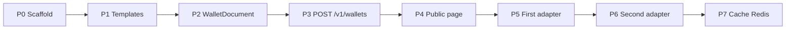

# Roadmap

**Status:** accepted  
**Date:** 2026-08-25  
**Relates-to:** [PDR](PDR.md), [SDD](SDD.md), [wallet-api](specs/wallet-api.md), [DIAGRAMS](DIAGRAMS.md), [USE-CASE-MAP](USE-CASE-MAP.md)

Feature sequence for this repo. Update this file when a slice lands or when a later item becomes the next slice. Route names must match the SPEC (`POST /v1/wallets`, `GET /p/{publicId}`).

## Sequence

**CON-1309 go/no-go** sits after **P5**: the [mock skill](../.cursor/skills/con-1309-mock-wallet-call/SKILL.md) runs two payloads, one contract, a public URL, and **one** device-openable wallet. P6 and P7 do not block go.

P4 before the adapters so `publicUrl` is real as soon as POST persists a document. The first adapter then stamps that URL into the pass QR.

## Wave A — CON-1309 viability

| Phase | What ships | Done when |
| --- | --- | --- |
| **P0 Scaffold** | NestJS + Fastify hello app, hexagonal folders, health/ready. No domain. | **Done.** `GET /health` and `GET /ready` (`npm run start:dev`). |
| **P1 Templates** | File-based registry, JSON Schema + Ajv, field flags `wallet` / `public`. Generic schema (title, fields, image, links). Not Animal types. | **Done.** Invalid `data` fails Ajv validation without DynamoDB (`GENERIC` v1 in `src/templates/generic/v1/`). |
| **P2 WalletDocument** | Domain entity + DynamoDB adapter (`save`, `findById`, `findByPublicId`). | **Done.** Document round-trips by `id` and `publicId` (LocalStack DynamoDB). |
| **P3 POST /v1/wallets** | One `provider` (`APPLE` or `GOOGLE`), persist, return `id` + `publicUrl`. Adapter may still be a stub (`FAILED` until P5). `Idempotency-Key` can wait until Wave B if local retries are rare. | **Done.** 400 on bad template/`provider`; 201 with `id` + `publicUrl` (stub `FAILED` until P5). |
| **P4 Public page** | `GET /p/{publicId}` HTML from **public** fields only, using [`public-page/`](../public-page/) + [public-page spec](specs/public-page.md). Always unauthenticated. DynamoDB read (no Redis yet). | Scanner/browser shows the payload fields in theme slots (`GENERIC`: hero + facts + links). |
| **P5 First adapter** | Apple **or** Google — pick one for the timebox. Timeouts, S3 for `.pkpass` if Apple, JWT save URL if Google. QR = this service’s public URL. | Pass opens on a real device/simulator. **CON-1309 numeric gate.** |

Wave A caller is the **CON-1309 mock skill** (`.cursor/skills/con-1309-mock-wallet-call/`): file template `GENERIC` v1, two static POSTs (`demo-a`, `demo-b`). Not LTR/FTA/Platform.

**Wave A out:** production deploy, dual ALB, Redis, second provider, Platform mapping, template admin API.

## Wave B — complete the service (unblocks replacement)

| Phase | What ships | Notes |
| --- | --- | --- |
| **P6 Second adapter** | The provider not done in P5. Still **one provider per POST**. | Two POSTs if a product wants both platforms. |
| **P7 Redis cache** | Cache `GET /p/{publicId}` by `publicId`. DynamoDB stays source of truth. | **Decided**, not in Wave A. Invalidate or TTL when documents change. |
| **P8 Idempotency** | Honor `Idempotency-Key` so caller retries do not duplicate documents. | Required before Platform is a real caller. |
| **P9 Observability** | OpenTelemetry + Datadog on create, generate, public GET, provider timeouts. | |
| **P10 Dual ingress** | DevOps: `/v1/*` private, `/p/*` public. No app auth. | Stack work. Localhost can bind both. |
| **P11 Secrets** | Apple certs and Google SA key from Secrets Manager (not repo files) in deployed envs. | Local can still use env/files. |

## Wave C — product callers (not this service’s domain)

| Phase | Who | Notes |
| --- | --- | --- |
| **P12 Templates for the wedge** | This repo | `PET_CARD` / stay-shaped schemas from [USE-CASE-MAP](USE-CASE-MAP.md). Mapping still lives in the caller. Lost pet may be public-page-only. |
| **P13 Platform caller** | Platform | Replace in-process `WalletService` with POST here. First real STR path (stay pass + shared QR). |
| **P14 LTR / FTA / partners** | Those BEs | Same contract, their own mapping. Dotted on [DIAGRAMS 1a](DIAGRAMS.md#1a-who-generates-a-wallet). |

## Intentionally later or out

Do not put these on the Wave A/B sequence until a new ADR says so.

| Item | Why |
| --- | --- |
| Template admin API (`createTemplate`) | Wave A/B use files in the repo. |
| Attach second provider to the same document | Today: two POSTs, two documents. |
| Live pass updates / Apple push / Google PATCH | PDR non-goal. |
| SQS / bulk generate | Sync POST is the contract. |
| App-level auth (JWT, API keys) | Network isolation only. |
| Auth on the public page | Permanently public. |
| Passport UI, analytics, visa flows | CON-1297 in Passport + Platform. |

## Suggested next code slice

**P4** — `GET /p/{publicId}` HTML from public-flagged fields only (`public-page/` theme; unauthenticated).
