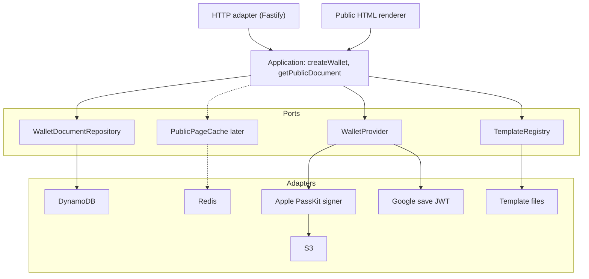
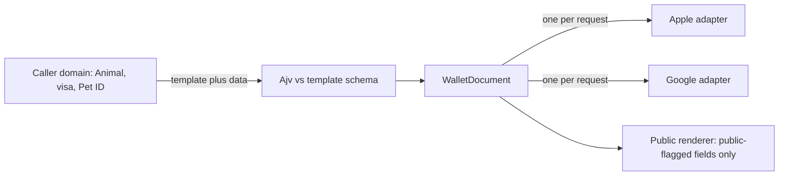

# SDD: Wallet generation service

**Status:** accepted  
**Date:** 2026-08-25  
**Relates-to:** [PDR](PDR.md), [ADR-001](ADR-001-wallet-generation-service-architecture.md), [wallet-api](specs/wallet-api.md), [DIAGRAMS](DIAGRAMS.md), [USE-CASE-MAP](USE-CASE-MAP.md), [CON-1309](https://petscreening.atlassian.net/browse/CON-1309), [CON-1297](https://petscreening.atlassian.net/browse/CON-1297)

This is the canonical software design for **this** service. As-built Platform behavior lives under [as-built/](as-built/) and is not the target API.

## Purpose

A domain-agnostic service that accepts a static payload, validates it against a **template**, persists a `WalletDocument`, generates **one** Apple **or** Google wallet artifact **in the same request**, and hosts a public HTML page. Callers (first: Platform) map their own models into `data`. This service does not own Animal, visa, tag number, or Pet ID identity.

CON-1297 fields (SA task copy, ESA letter link, visa links, trust signals) arrive as JSON keys the template allows. The [use-case map](USE-CASE-MAP.md) is the longer product list (STR stay, LTR lease, care network, partner credentials). Adding a use case is a **template version**, not a domain change.

## Stack (ADR-001)

| Concern | Choice |
| --- | --- |
| Runtime | Node.js LTS |
| Language | TypeScript, strict |
| Framework | NestJS + Fastify |
| Shape | Hexagonal (ports and adapters) |
| Validation | JSON Schema + Ajv |
| Documents | DynamoDB (source of truth) |
| Public-page cache | Redis (decided; not in first slices) |
| Binaries / assets | S3 |
| Secrets | AWS Secrets Manager |
| Observability | OpenTelemetry + Datadog |
| Generation | Synchronous (no SQS on the create path) |

## Hexagonal layout



System context, containers, use cases, and both request sequences: [DIAGRAMS](DIAGRAMS.md).

Core must not contain `passTypeIdentifier`, `primaryFields`, `genericObject`, `genericClass`, `textModulesData`, GraphQL types, `Animal`, or `tagNumber`.

## Domain: `WalletDocument`

```ts
interface WalletDocument {
  id: string;
  publicId: string;
  templateKey: string;
  templateVersion: number;
  source?: string;
  sourceReference?: string;
  data: Record<string, unknown>;
  providers: {
    apple?: ProviderState;
    google?: ProviderState;
  };
  status: WalletDocumentStatus;
  createdAt: Date;
  updatedAt: Date;
  expiresAt?: Date;
}
```

- `id` — internal document id (ULID).
- `publicId` — cryptographically random, high entropy (not sequential); used only in `/p/{publicId}`. Never a Platform animal id or tag number.
- `source` / `sourceReference` — optional caller hints (e.g. `platform`, occupancy id) for idempotent lookup later; not required for CON-1309.
- `status` — `ACTIVE` at create. `EXPIRED` is reserved for later `expiresAt` handling; not applied in Wave A.
- `providers.apple` / `providers.google` — optional `ProviderState`: `{ status: 'PENDING' | 'READY' | 'FAILED'; url?: string; error?: string }`. One `POST /v1/wallets` fills **exactly one**. Need both platforms? Two requests (two documents unless a later attach-provider exists).

## Templates

Identified by key + immutable version (`PET_CARD:v1`, later `VISA:v1`, etc.). Each document stores the version used at generation. New versions must not reinterpret old documents.

A template defines:

- JSON Schema for `data`
- Which fields are `wallet` vs `public` (payload is **not** all public by default)
- Apple mapping and visual/assets config
- Google mapping
- Required vs optional fields

**First slice (CON-1309):** a generic schema (title, subtitle, image URL, 3–5 display fields, optional links). Not Animal types. Files: `src/templates/generic/v1/`. A `PET_CARD` template can be added when Platform maps CON-1297 data; that mapping stays in Platform.



## Create flow (synchronous)

`POST /v1/wallets` with `Idempotency-Key` (callers should send it in production so retries do not duplicate documents; **P3 does not honor it** — see [ROADMAP P8](ROADMAP.md)). The handler itself has **no application authentication**.

1. Resolve template (key + default current version unless specified).
2. Ajv-validate `data`. Reject before persist on failure.
3. Create `WalletDocument` + `publicId`; persist.
4. Call **exactly one** `WalletProvider.generate` for the requested `provider` (`APPLE` or `GOOGLE`), with timeout and limited retries. **P5:** Google Save-to-Wallet JWT when `GOOGLE_WALLET_*` is configured. Apple remains a stub (`FAILED` / `PROVIDER_UNAVAILABLE`) until P6.
5. Return **201 Created** with `publicUrl` (`{PUBLIC_BASE_URL}/p/{publicId}`) and that provider’s status. Do not use 202.

If that provider fails, the document and public page can still exist (`provider.status: FAILED`). Timeouts must not hang the HTTP request. Do **not** generate Apple and Google in the same request.

Apple adapter (reuse Platform learnings): generic PassKit zip, SHA-1 manifest, CMS signature, S3 object. Google adapter: Save-to-Wallet JWT, no `objects.insert`. Object/class ids must not be tag numbers.

QR/barcode message = this service’s public URL, not Passport `pet-card/{tagNumber}`.

## Public page

`GET /p/{publicId}` loads the document, applies the stored template version, renders HTML from **public** fields only. **Always public** — no login now or later. This is the only route published on the public ingress.

Visual contract (slots, chrome, what is *not* on this URL): [public-page spec](specs/public-page.md). Tokens and `wp-*` components: [`public-page/`](../public-page/). The renderer binds slots (`photo`, `title`, `facts`, …), never `Animal` or `tagNumber`. CON-1309 `GENERIC` is hero + facts + links; Pet ID tabs/badges wait for a `PET_CARD` template (P12) and caller mapping.

First slices read DynamoDB by `publicId`. A Redis cache for that lookup is **decided** and will be added in a later slice (see [DIAGRAMS](DIAGRAMS.md#2-containers-and-persistence)).

## Persistence

DynamoDB access patterns: by `id`, by `publicId`, later by `source` + `sourceReference`, update provider state. Application depends on `WalletDocumentRepository` only (`save`, `findById`, `findByPublicId`).

Table `WALLET_DOCUMENTS_TABLE` (local default `wallet-documents`):

- Partition key: `id` (S)
- GSI `publicId-index`: partition key `publicId` (S)
- Billing: on-demand (`PAY_PER_REQUEST`)
- Dates stored as ISO-8601 strings; `data` as a document map

`publicUrl` uses `PUBLIC_BASE_URL` (local default `http://localhost:3000`).

Local: LocalStack (Docker Compose, port `4566`, `AWS_ENDPOINT_URL`). If Platform already owns `4566`, reuse that instance — do not start a second LocalStack. Production table is DevOps; this service does not provision AWS.

Redis caches public-page reads by `publicId`. It is not the source of truth. First features may skip it; the port must stay easy to add without changing the generate path.

S3: template images, Apple assets, generated `wallet-artifacts/{documentId}/apple.pkpass`.

## Access control and replacement

The NestJS app implements **no authentication**. Access is a **DevOps** split of ingress:

- **Private:** `POST /v1/wallets`, `GET /v1/wallets/{id}/apple`, and any other `/v1/*`. Not reachable from the public internet. Callers are Platform (and later LTR/FTA) on the internal network.
- **Public:** `GET /p/{publicId}` only. Always unauthenticated; do not add auth on this route later.

Local/CON-1309 can bind both routes on localhost. Production must publish them on separate listeners (or equivalent path/host rules) so generate cannot be hit from outside.

**Replacement:** Platform `createAnimalWalletCard` becomes: load animal, map CON-1297-capable `data`, POST here over the private network, return provider URLs to Passport. Cutover is a Platform change; this SDD must not require GraphQL or Animal in-core.

## MVP vs later

Phased sequence, CON-1309 gate, and later waves: [ROADMAP](ROADMAP.md).

## Out of core

Payments, Passport UI, analytics, visa workflows, guest-token animal scoping (that is Platform GraphQL today).
