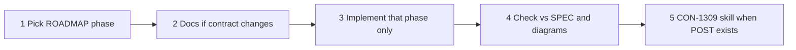

# Agentic workflow

**Status:** accepted  
**Relates-to:** [ROADMAP](ROADMAP.md), [SDD](SDD.md), [wallet-api](specs/wallet-api.md)

Small loop so humans and agents stay consistent. Not a multi-agent org. One slice at a time.

## Loop

1. **Pick the next open phase** in [ROADMAP](ROADMAP.md). Do not start P5 during P0.
2. **Docs first if the contract or architecture moves** (new route, new store, new decision). Same PR: SPEC and/or SDD and/or DIAGRAMS and/or ADR. Do not add a second ADR unless it is a real decision (the architecture ADR already exists).
3. **Implement only that phase.** Hexagonal: Apple/Google stay in adapters. Domain has no `Animal`, `tagNumber`, or GraphQL.
4. **Check:** routes match SPEC (`POST /v1/wallets`, one `provider`; `GET /p/{publicId}` public). Update [DIAGRAMS](DIAGRAMS.md) if a box or arrow changed.
5. **Demo (from P3 on):** use [.cursor/skills/con-1309-mock-wallet-call](../.cursor/skills/con-1309-mock-wallet-call/SKILL.md). Never Platform/LTR/FTA for CON-1309.

## Hard rules

- No application auth. Generate is private ingress (DevOps); public page stays public forever.
- One Apple **or** Google per POST, never both.
- Redis is decided but not Wave A.
- Templates in Wave A/B are files, not an admin API.
- Branch: `CON-1309-be-short-kebab-title`. Commit: `CON-1309: Imperative description`.

## Stop

If the user asks for Platform mapping, live pass updates, SQS, or JWT in NestJS, point at ROADMAP Wave C / “intentionally later” and do not implement unless they explicitly override.
